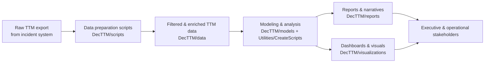
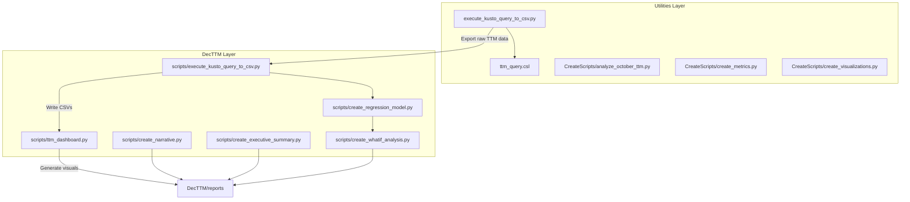
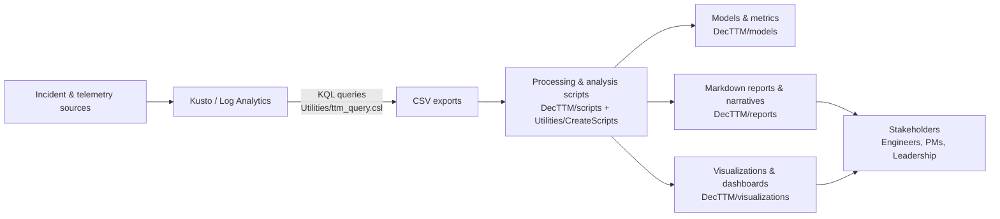

# QEI_TTM_ANALYSIS_EXPORTED

Automated Time-To-Mitigation (TTM) analysis and reporting workspace for QEI data. This repository contains scripts, prompts, and utilities for generating incident narratives, executive summaries, dashboards, and what-if analysis based on TTM data exports.

## Structure

- [DecTTM/](DecTTM) – December TTM analysis data, models, scripts, reports, and visualizations.
- [Utilities/](Utilities) – Shared utilities, prompts, and higher-level scripts for creating presentations, narratives, and metrics.
- [mcp.json](mcp.json) – Model Context Protocol configuration for automated workflows.
- [TTMAnalysis.prompt.md](TTMAnalysis.prompt.md) – Core prompt for TTM analysis workflows.

## Getting Started

1. Ensure Python 3.10+ is installed.
2. (Optional) Create and activate a virtual environment.
3. Install any dependencies required by the scripts you plan to run (for example, pandas, matplotlib, scikit-learn, etc.).
4. Use the scripts under [DecTTM/scripts/](DecTTM/scripts) or [Utilities/CreateScripts/](Utilities/CreateScripts) to generate reports and visualizations.

## High-Level Workflow (Mermaid)

## Execution Flow (Scripts)

## System Flow (Components)

## Version Control Notes

- Large raw data exports and derived CSV files should generally not be committed.
- Local environment files, caches, and build artifacts are ignored via `.gitignore`.

## License

Specify the license for this repository (e.g., MIT, Apache-2.0) before public use.
